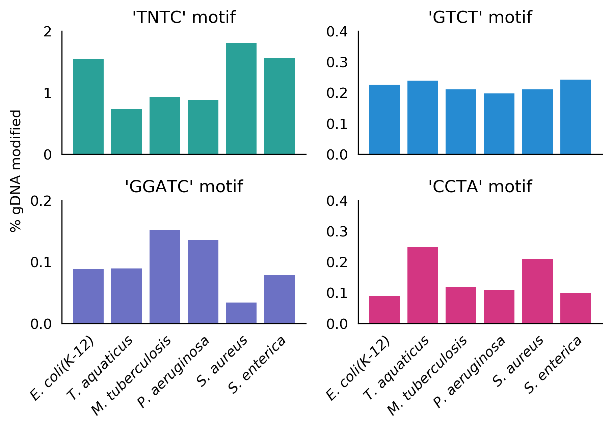
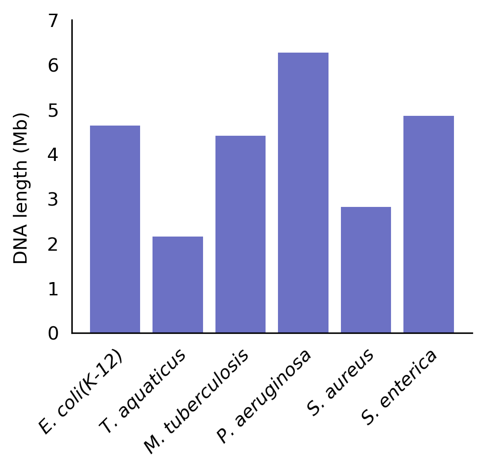
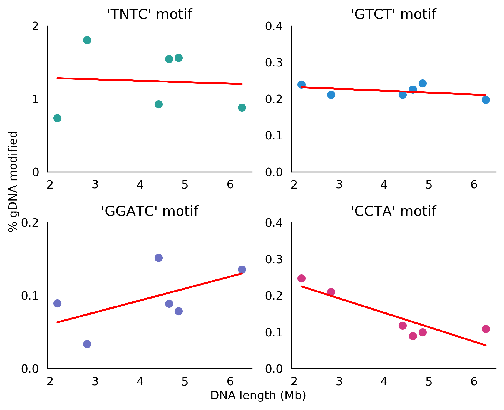

<p align="center">
  
</p>

**motifSearch** is a python package intended for the end-to-end analysis of motif frequency within genomic DNA. This package offers a means for downloading, measuring motif frequency, and visualising the resulting data.

### Downloading data
The NCBI accession number (RefSeq sequence) for a given species can be searched in the assembly database on NCBI [here](https://www.ncbi.nlm.nih.gov/assembly)
```
from motifsearch import countmotifs

# Create a dictionary containing the desired species name [key] and genomic DNA RefSeq sequence
bac_gdna_seqs = {
    'E. coli (K-12)': 'NC_000913.3',
    'T. aquaticus': 'NZ_CP010822.1',
    'M. tuberculosis': 'NC_000962.3',
    'P. aeruginosa': 'AE004091.2',
    'S. aureus': 'NC_007795.1',
    'S. enterica': 'NC_003197.2'
}

# Download dictionary of DNA sequences from NCBI
ms.download_dna(bac_gdna_seqs, 'bacterial-gDNA.fa')

# Rename the DNA sequence FASTA headers to match the key in the dictionary
ms.rename_fasta_id(bac_gdna_seqs, 'downloaded_DNA/bacterial-gDNA.fa', 'downloaded_DNA/bacterial-gDNA-renamed.fa')

```

### Count motif frequency

```
# Define the motifs to search. Accepts IUPAC codes
motifs = ['TNTC', 'GTCT', 'GGATC', 'CCTA']

# Instantiate motifsearch object
ms = motifsearch()

# Select source DNA file and count frequency of desired motifs
motif_df = ms.count('downloaded_DNA/bacterial-gDNA-renamed.fa', motifs)
motif_df.to_csv('bacterial_motif_counts.csv')

```

## Plotting motif data
### Motif frequency bar plot

```
# Plot motif frequencies for desired motifs of all species in dataframe
ms.motif_bar(motif_df, motifs)

```
<p align="left">
  
</p>


### Genomic DNA lengths
```
# Plot genomic DNA lengths
motif_bar_lengths(motif_df)

```

<p align="left">
  
</p>

### Linear regression of motif frequency and genome length
```
# Compare the motif frequency with genome length for different species
count_vs_length(motif_df, motitfs)
```

<p align="left">
  
</p>
